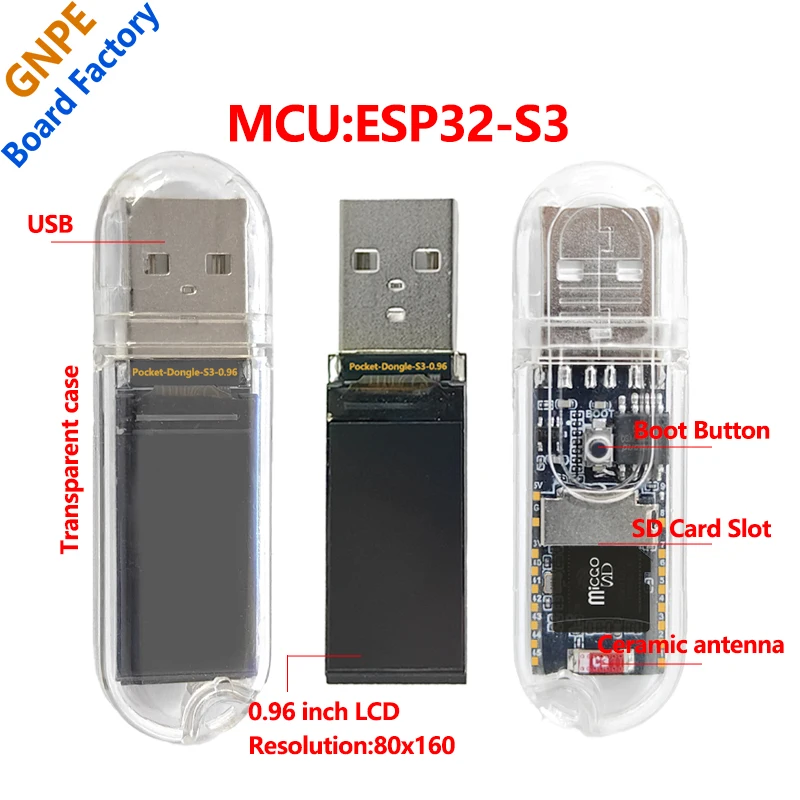

# Pocket-Dongle-S3

A device from AliExpress



## 📋 Overview

This repository contains everything you need to work with the ESP32-S3 Pocket Dongle, including firmware examples, Arduino libraries, ESP-IDF projects, and complete documentation. The device features:

- **ESP32-S3** microcontroller with dual-core processor
- **0.96" LCD display** for visual feedback
- **USB connectivity** for power and programming
- **Compact form factor** perfect for portable projects
- **GPIO access** for custom expansions

## 🚀 Features

- ✅ WiFi Station and Access Point modes
- ✅ Bluetooth Low Energy (BLE) support
- ✅ USB Mass Storage Device capability
- ✅ GPIO testing and control
- ✅ GIF animation display
- ✅ SD card support
- ✅ LVGL graphics library integration
- ✅ TFT display driver support

## 📁 Repository Structure

```
├── Arduino/                    # Arduino IDE projects and libraries
│   ├── examples/              # Example Arduino sketches
│   └── lib/                   # Required libraries (LVGL, TFT_eSPI, etc.)
├── ESP-IDF/                   # ESP-IDF framework projects
│   └── usb_msc_wireless_disk/ # USB Mass Storage implementation
├── firmware/                  # Pre-compiled firmware binaries
│   ├── 1 WIFI-STA/           # WiFi Station mode firmware
│   ├── 2 BLE/                # Bluetooth LE firmware
│   ├── 3 GPIO-Test/          # GPIO testing firmware
│   ├── 4 WIFI USB drive/     # WiFi USB drive firmware
│   └── 5 GIF/                # GIF animation firmware
├── Schematics/               # Hardware schematics and documentation
└── images/                   # Product images and media
```

## 🛠️ Getting Started

### Prerequisites

- **Arduino IDE** (version 1.8.19 or later) or **ESP-IDF** (version 4.4 or later)
- **ESP32-S3 board package** installed in Arduino IDE
- **USB-C cable** for programming and power

### Arduino IDE Setup

1. Install the ESP32 board package in Arduino IDE:
   - Go to `File` → `Preferences`
   - Add `https://raw.githubusercontent.com/espressif/arduino-esp32/gh-pages/package_esp32_index.json` to Additional Board Manager URLs
   - Go to `Tools` → `Board` → `Boards Manager`
   - Search for "ESP32" and install the latest version

2. Copy the required libraries from the `Arduino/lib/` directory to your Arduino libraries folder

3. Select the correct board:
   - `Tools` → `Board` → `ESP32 Arduino` → `ESP32S3 Dev Module`

### ESP-IDF Setup

1. Install ESP-IDF following the [official installation guide](https://docs.espressif.com/projects/esp-idf/en/latest/esp32s3/get-started/)
2. Navigate to the `ESP-IDF/usb_msc_wireless_disk/` directory
3. Run `idf.py build` to compile the project

## 📱 Example Projects

### 1. WiFi Station Mode
Connect the dongle to your WiFi network and access internet services.
- **Location**: `Arduino/examples/250428/WIFISTA/`
- **Firmware**: `firmware/1 WIFI-STA/target.bin`

### 2. Bluetooth LE Mouse
Use the dongle as a wireless BLE mouse controller.
- **Location**: `Arduino/examples/250428/ESP32-BLE-Mouse-master/`
- **Firmware**: `firmware/2 BLE/target.bin`

### 3. GPIO Testing
Test and control GPIO pins with visual feedback on the LCD.
- **Location**: `Arduino/examples/250428/GPIO_Test/`
- **Firmware**: `firmware/3 GPIO-Test/target.bin`

### 4. WiFi USB Drive
Create a wireless USB storage device accessible over WiFi.
- **Location**: `ESP-IDF/usb_msc_wireless_disk/`
- **Firmware**: `firmware/4 WIFI USB drive/esp32-S3_firmware_0.96-usb.bin`

### 5. GIF Animation Player
Display animated GIFs on the built-in LCD screen.
- **Location**: `Arduino/examples/250428/GIF/`
- **Firmware**: `firmware/5 GIF/target.bin`

## 📊 Hardware Specifications

| Component | Specification |
|-----------|---------------|
| **MCU** | ESP32-S3 (Dual-core Xtensa LX7) |
| **Flash** | 8MB |
| **RAM** | 512KB SRAM |
| **Display** | 0.96" LCD (80x160 pixels) |
| **Connectivity** | WiFi 802.11 b/g/n, Bluetooth 5.0 LE |
| **Interface** | USB-C |
| **GPIO** | Multiple accessible pins |
| **Power** | 5V via USB-C |

## 🔌 Pinout & Connections

Detailed hardware schematics and pinout information can be found in:
- 📄 **[Hardware Schematic (PDF)](Schematics/ESP32-S3-0.96LCD.pdf)**

## 📚 Libraries Used

- **[LVGL](https://lvgl.io/)** - Graphics and GUI library
- **[TFT_eSPI](https://github.com/Bodmer/TFT_eSPI)** - TFT display driver
- **[JPEGDecoder](https://github.com/Bodmer/JPEGDecoder)** - JPEG image decoding
- **[ESP32-BLE-Mouse](https://github.com/T-vK/ESP32-BLE-Mouse)** - Bluetooth LE mouse functionality

## 🔧 Flashing Firmware

### Using Pre-compiled Binaries

1. Download the desired firmware from the `firmware/` directory
2. Use ESP Flash Tool or esptool.py:
   ```bash
   esptool.py --chip esp32s3 --port COM3 write_flash 0x0 target.bin
   ```

### Building from Source

1. Open the desired example in Arduino IDE or ESP-IDF
2. Configure the board settings
3. Compile and upload to your device

## 🤝 Contributing

Contributions are welcome! Please feel free to submit pull requests, report bugs, or suggest new features.

1. Fork the repository
2. Create your feature branch (`git checkout -b feature/AmazingFeature`)
3. Commit your changes (`git commit -m 'Add some AmazingFeature'`)
4. Push to the branch (`git push origin feature/AmazingFeature`)
5. Open a Pull Request

## 📄 License

This project is licensed under the MIT License - see the [LICENSE](LICENSE) file for details.

## 🛒 Hardware Source

This ESP32-S3 Pocket Dongle can be found on AliExpress and similar electronics marketplaces. Search for "ESP32-S3 0.96 LCD USB dongle" or similar terms.
